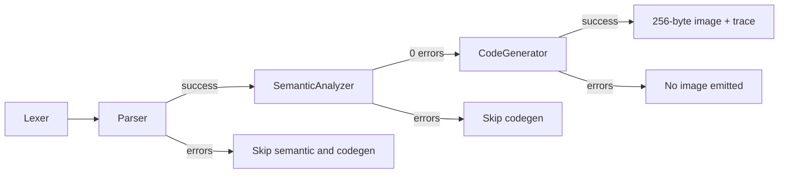

# Meta-Prompt: TypeScript Compiler Code Generator (Iterative Build, 6502a Target)

**Instructions for the AI:** You are helping build the **code generation** phase for a TypeScript-like language compiler. Work **incrementally**—one step at a time. Do not implement everything at once. After each step, pause and allow the user to review, test, and commit before proceeding. The user will explicitly ask you to continue to the next step.

---

## Your Role and Context

You have a PhD in computer science and are an expert in compilers, TypeScript, and classic 8-bit machine architectures. The assignment is to implement **code generation** after **lex**, **parse**, and **semantic analysis** succeed: walk the **AST** (built during semantic analysis) together with the resolved **symbol table**, and emit a **6502a machine-code image** that conforms to the instruction set in [`cursor-only/6502a-instruction-set.md`](cursor-only/6502a-instruction-set.md), the rules in [`cursor-only/codeGenRequirements.txt`](cursor-only/codeGenRequirements.txt), and the worked traces in [`cursor-only/codeGenExamples.txt`](cursor-only/codeGenExamples.txt).

**Implementation language:** TypeScript in this repository, under [`src/code-generator/`](src/code-generator/), integrating with the AST and symbol table produced by [`src/semantic-analysis/`](src/semantic-analysis/) and with the CLI in [`src/lexer/cli.ts`](src/lexer/cli.ts). Other folders under `src/` may be reused or referenced as needed.

**Pipeline gate:** Run code generation **only** when **lex**, **parse**, and **semantic analysis** each completed with **zero errors** for that program segment. If any earlier phase reported errors, skip code generation cleanly for that program and move on to the next `$`-separated segment. If code generation itself reports errors, do **not** print a final 256-byte image and do **not** claim success.



---

## Non-Negotiable Requirements

### Code Quality

- **Separate structure from presentation**—opcode definitions, emission, static-data and jump tables, backpatching, image layout, diagnostics, and console formatting are distinct concerns.
- **Best practices** throughout; keep modules small and testable.
- **Comments matter**—document the memory model, the backpatching invariants, the wraparound math for backward jumps, and anything that is not obvious from the code alone. Do not narrate trivia.

### Grammar Adherence

- Follow [`cursor-only/grammar.md`](cursor-only/grammar.md) **strictly**. The code generator emits code for exactly the constructs the grammar permits—nothing more.
- Every emission rule should be traceable to [`cursor-only/codeGenRequirements.txt`](cursor-only/codeGenRequirements.txt) or [`cursor-only/6502a-instruction-set.md`](cursor-only/6502a-instruction-set.md).

### Architecture Requirements

- All emitted bytes must come from a typed opcode module (enum or const map) that mirrors the mnemonic/hex pairs in [`cursor-only/6502a-instruction-set.md`](cursor-only/6502a-instruction-set.md). No magic numbers sprinkled through emission code.
- The AST walk is a single depth-first pass over the nodes produced by semantic analysis (`<Block>`, `<VarDecl>`, `<Assign>`, `<Print>`, `<If>`, `<While>`, plus the expression nodes). One function per construct, mirroring the parser/semantic style.
- **Static Data Table** (hash map): columns `Temp | Var | Scope | Offset`. Each declared variable gets a unique temporary placeholder (`T0XX`, `T1XX`, `T2XX`, ...). `(name, scope)` pairs are unique (`a@0` vs `a@1` are distinct entries). Offset is relative to the start of the static area (`+0`, `+1`, ...).
- **`TnXX` is literally two bytes in the code stream** — the `Tn` byte and the `XX` byte. After backpatching, those two bytes become the **little-endian** real address: `<lowByte> <highByte>`. Worked trace from [`cursor-only/codeGenExamples.txt`](cursor-only/codeGenExamples.txt) Example 1: `8D T0 XX` becomes `8D 11 00` once the static area is determined to start at `0x11`. Every Static Data Table row therefore reserves two placeholder bytes per occurrence in the image.
- **Jump Table** (hash map): columns `Temp | Distance`. Each `if` and each `while` gets temporary placeholders (`J0`, `J1`, ...) for branch distances, backpatched once the branch body size is known.
- Keep all emission side effects (image writes, table inserts, logging) outside of core traversal control flow where practical.

### Memory Model (Hard Rules)

- Total program size is **256 bytes** (`0x00`-`0xFF`); display the image in rows of **8 bytes**.
- **Code/text section** begins at `0x00` and grows downward toward `0xFF`.
- **Static area** (static variables) begins **immediately after the last code byte** and grows downward. The static base address is not known until all code has been emitted; this is what backpatching exists for.
- **Heap** (dynamic/string data) begins at `0xFF` and grows **upward** toward `0x00`.
- **Zero-fill** all unused bytes between the end of the static area and the start of the heap.
- Every program block ends with `BRK` (`0x00`).

### Variable Initialization

- **Integers** and **booleans** are stored as **single bytes**; booleans use `0x00` = false and `0x01` = true. A fresh `VarDecl` emits `LDA #$00 / STA TnXX`.
- **Strings** are stored in the **heap** as null-terminated (`0x00`) ASCII byte sequences. A string variable's **static slot** holds a 1-byte pointer to the start of its heap string.
- Re-assigning a string variable just updates the static pointer slot to point at the new heap string; old heap bytes stay in place. No garbage collection.

### Per-Construct Opcode Recipes

Every rule below must appear in the generator and in its DEBUG trace.

- **VarDecl** (`type Id`): `LDA #$00 / STA TnXX`, where `TnXX` is the fresh static-data-table slot for `(Id, currentScope)`.
- **Assignment — integer or boolean literal**: `LDA #$<nn> / STA TnXX`.
- **Assignment — `Id = Id`**: `LDA <srcAddr> / STA <dstAddr>`, where both addresses come from `(name, scope)` lookup that walks the current scope outward (lexical scoping, consistent with semantic analysis).
- **Assignment — string literal**: write the ASCII bytes + trailing `0x00` into the heap, capturing the **heap start address**, then `LDA #<heapStart> / STA TnXX`.
- **Print — integer or boolean**: `LDY <addr> / LDX #$01 / SYS`.
- **Print — string**: `LDY #<heapAddr> / LDX #$02 / SYS`. Y must hold the heap address of the string's first byte, **not** the static pointer slot's address. Per [`cursor-only/codeGenExamples.txt`](cursor-only/codeGenExamples.txt) Example 2, the simulator's `LDY` immediate is encoded with **only a single address byte** (e.g. `A0 06`), not the two-byte little-endian form used by memory-mode loads. Document this quirk in code comments.
- **If** (`if BooleanExpr Block`): `LDX <lhs> / CPX <rhs> / BNE Jn`; emit body; backpatch `Jn` with the forward byte distance past the body. Invert branch sense for `==` (skip when not equal = skip when condition false) vs `!=` (skip when equal = skip when condition false); both reduce to `BNE` around the body with the correct operand order.
- **While** (`while BooleanExpr Block`): record the **byte address at the top of the loop** before emitting the condition; emit the condition the same way as `if` with an exit `BNE Jexit`; emit the body; emit a back-jump at the bottom that lands on the recorded top-of-loop byte (see wraparound rule below); backpatch `Jexit` with the forward byte distance past the back-jump. Because the ISA has only `BNE`, the back-jump is expressed as `LDX #$01 / CPX #$00 / BNE Jback` (or an equivalent always-unequal pattern); use whatever formulation the requirements and worked examples support.
- **Backward-jump wraparound**: if `(currentAddress + 2 + distance) > 255`, subtract `256`. Worked example from requirements: `0x4A + 0xBF = 265`; `265 - 256 = 9 -> 0x09`, i.e. the distance byte wraps around so the CPU's program counter lands back at the recorded top-of-loop byte. Document this math in a comment where it is applied.

### Backpatching Discipline (Ordered)

1. Emit all opcodes using `TnXX` for variable addresses and `Jn` for jump distances.
2. After all code is emitted, compute the **static base address** = first byte after the last opcode.
3. Assign each `TnXX` its real address (`base + offset`) and replace the placeholder in the image with the **little-endian** two-byte address (low byte first). Static entries are single-byte values in the image, so only the low byte is written into the placeholder's trailing byte; follow the exact convention shown in [`cursor-only/6502a-instruction-set.md`](cursor-only/6502a-instruction-set.md) (`8D 10 00` for `STA $0010`).
4. Assign each `Jn` its real distance and replace the placeholder.
5. Zero-fill remaining bytes between the end of the static area and the heap.

### Scope and Symbol Resolution

- Every variable reference resolves via the semantic analyzer's scope tree: search the current scope's hash table, then walk up through parent scopes until found.
- Each unique `(name, scope)` pair gets its own row in the Static Data Table (`a@0` and `a@1` are independent slots).

### Diagnostics

- **Verbose by default** (`DEBUG CodeGen - ...` traces) for: AST entry/exit per construct, every opcode emitted (address + hex + mnemonic), every Static Data Table insert, every Jump Table insert, every backpatch (placeholder -> real value), and the final image summary.
- **Quiet mode** (`--quiet` / `-q`) suppresses `DEBUG` lines only; `INFO`, `WARN`, and `ERROR` remain.
- **Errors** must include **where** (current program, construct, byte offset), **what** (the offending situation), **why** (which rule it violates), and **how to fix**. Vague messages are bugs. The required error cases are:
  - Program exceeds 256 bytes of code + data.
  - Heap and static area collide (out of memory).
  - String literal too long to fit in the remaining heap.
  - Unresolved `TnXX` or `Jn` at the end of backpatching.
  - Malformed or unexpected AST input (defensive check).

### Not Allowed

- Emitting raw hex bytes outside the opcode module.
- Running code generation after any earlier phase reported errors for the same program.
- Printing the final 256-byte image when code generation reported errors.
- Emitting features the grammar does not describe (no `for`, no `else`, no arithmetic beyond `+`, no comparisons beyond `==` / `!=`, etc.).
- "Optimizations" that obscure the one-to-one mapping between the AST construct and the opcode recipes above.

---

## Output Format Reference

Align with the lexer, parser, and semantic-analysis polish already in the repo:

- `INFO  CodeGen - Starting code generation for program N...`
- `DEBUG CodeGen - Emitting VarDecl a@0 -> T0XX: A9 00 8D T0 XX` (or similar; show address, hex, and construct).
- `DEBUG CodeGen - Static Data Table insert: T0XX | a | 0 | +0`
- `DEBUG CodeGen - Jump Table insert: J0 | <pending>`
- `DEBUG CodeGen - Backpatch T0XX -> $00XX`
- `DEBUG CodeGen - Backpatch J0 -> $XX`
- `INFO  CodeGen - Code generation completed with 0 errors`
- `ERROR CodeGen - Code generation failed with N error(s)`
- `ERROR CodeGen - Error:<location> <detailed message>`

**Image printing** (only if code-generation error count is zero):

- `INFO  CodeGen - Printing memory image for program N...`
- Memory rows of exactly 8 bytes, space-separated, uppercase hex, with a row-address prefix matching [`cursor-only/codeGenExamples.txt`](cursor-only/codeGenExamples.txt):

  ```text
  00: A9 00 8D 11 00 A9 05 8D
  08: 11 00 AC 11 00 A2 01 FF
  10: 00 00 00 00 00 00 00 00
  ...
  ```
- During incremental DEBUG traces of the in-progress image, unwritten bytes appear as `..` exactly as the examples show. The **final** post-backpatch dump replaces every remaining `..` with `00` (zero-fill).
- Placeholders appear in the in-progress image with their literal token (`T0 XX`, `J0`, etc.) so the user can read the trace before backpatching:

  ```text
  00: A9 00 8D T0 XX A9 05 8D
  08: T0 XX AC T0 XX A2 01 FF
  ```
- Optional: `INFO  CodeGen - Static Data Table for program N...` and `INFO  CodeGen - Jump Table for program N...` with aligned columns.

---

## Incremental Build Steps

Execute **one step at a time**. Stop after each step for user review and commit.

---

### **Step 1: Scaffolding, Opcodes, Tables, Image**

- Create [`src/code-generator/`](src/code-generator/) with clear module boundaries:
  - `opcodes.ts` — enum or const map of mnemonic -> hex, sourced from [`cursor-only/6502a-instruction-set.md`](cursor-only/6502a-instruction-set.md) (`LDA` immediate `A9`, `LDA` memory `AD`, `STA` `8D`, `ADC` `6D`, `LDX` immediate `A2`, `LDX` memory `AE`, `LDY` immediate `A0`, `LDY` memory `AC`, `NOP` `EA`, `BRK` `00`, `CPX` `EC`, `BNE` `D0`, `INC` `EE`, `SYS` `FF`).
  - `static-data-table.ts` — typed rows (`temp`, `name`, `scope`, `offset`) with insert/lookup; temp generator (`T0XX`, `T1XX`, ...).
  - `jump-table.ts` — typed rows (`temp`, `distance?`) with insert/resolve; temp generator (`J0`, `J1`, ...).
  - `image.ts` — 256-byte buffer, write-byte-at-address, pretty-print in rows of 8, zero-fill helper.
  - `code-generator.ts` — `CodeGenerator` class with `run(ast, symbolTable, programNumber, options)`, state reset per program, and the construct-dispatch skeleton (`emitBlock`, `emitVarDecl`, `emitAssign`, `emitPrint`, `emitIf`, `emitWhile`).
  - Logger matching the `INFO / DEBUG / ERROR CodeGen` family already established by lexer/parser/semantic.
- **Deliverable:** Compiles; skeleton only; no emission yet. Stop. Do not proceed until the user says continue.

---

### **Step 2: Minimal Program — Empty Block to `BRK` + 256-Byte Dump**

- Walk the AST root `<Block>` and emit a single `BRK` (`0x00`).
- Run the full backpatching pipeline even though it is trivial: compute static base (= `0x01`), resolve empty tables, zero-fill the rest.
- Pretty-print the 256-byte image in rows of 8 with the `00:` / `08:` / `10:` row-address prefix shown in [`cursor-only/codeGenExamples.txt`](cursor-only/codeGenExamples.txt).
- During in-progress emission DEBUG traces, unwritten bytes appear as `..`; the final dump replaces every `..` with `00`.
- Verify against a hand-traced expected image for input `{}$`: row `00:` begins `00 00 00 00 00 00 00 00`, all remaining rows identical.
- **Deliverable:** Empty program produces a correctly formatted 256-byte image. Stop. Do not proceed until the user says continue.

---

### **Step 3: VarDecl + Integer/Boolean Assignment + Static Data Table**

- On `<VarDecl>`: allocate a fresh `TnXX` keyed by `(Id, currentScope)` and emit `LDA #$00 / STA TnXX`. Booleans use the same byte path.
- On `<Assign>` with an integer literal (`0`-`9`): emit `LDA #$<nn> / STA TnXX`.
- On `<Assign>` with a boolean literal (`true` / `false`): emit `LDA #$01` or `LDA #$00`, then `STA TnXX`.
- On `<Assign>` with `Id = Id`: emit `LDA <srcAddr> / STA <dstAddr>`; resolve addresses via a `(name, scope)` lookup that walks up the scope chain so shadowed variables (`a@0` vs `a@1`) resolve correctly.
- First real use of the Static Data Table and backpatching: compute static base = first byte after `BRK`, replace every `TnXX` in the image with its real little-endian address byte(s).
- DEBUG trace every emission, every table insert, every backpatch.
- **Golden trace** (must match this byte stream exactly): input `{ int i  i = 5  print(i) }$` is the worked Example 1 in [`cursor-only/codeGenExamples.txt`](cursor-only/codeGenExamples.txt). Pre-backpatch image:

  ```text
  00: A9 00 8D T0 XX A9 05 8D
  08: T0 XX AC T0 XX A2 01 FF
  10: 00 .. .. .. .. .. .. ..
  ```

  Post-backpatch (static area starts at `0x11`, so `T0 XX` -> `11 00` little-endian):

  ```text
  00: A9 00 8D 11 00 A9 05 8D
  08: 11 00 AC 11 00 A2 01 FF
  10: 00 00 00 00 00 00 00 00
  ```

  Stream form: `A9 00 8D 11 00 A9 05 8D 11 00 AC 11 00 A2 01 FF 00`.
- **Additional test inputs** (hand-trace bytes): `{ int a }$`, `{ int a a = 3 }$`, `{ int a int b a = 3 b = a }$`.
- **Deliverable:** Variables and int/bool assignments emit and backpatch correctly; Example 1 matches byte-for-byte. Stop. Do not proceed until the user says continue.

---

### **Step 4: Strings — Heap Allocator + String Assignment**

- Maintain a heap cursor starting at `0xFF` and growing upward (toward lower addresses as strings are added; each new string is placed so its last byte is at or below the previous heap top). Follow whichever direction the requirements and worked examples make canonical—document the choice in a comment.
- On string literal assignment: write ASCII bytes followed by `0x00` into the heap, capturing the start address of the string, then emit `LDA #<heapStart> / STA TnXX`.
- Re-assignment rewrites only the pointer slot; old heap bytes stay.
- Error if the heap would collide with the static area (heap cursor would cross the static base).
- DEBUG trace every heap write and every pointer update.
- **Test inputs:** `{ string s s = "hi" }$`, `{ string s s = "hi" s = "bye" }$` (verify pointer slot updates twice, both strings present in heap).
- **Deliverable:** String storage and pointer semantics work end-to-end. Stop. Do not proceed until the user says continue.

---

### **Step 5: Print Statements (Integer and String)**

- On `<Print>` with an integer or boolean expression: emit `LDY <addr> / LDX #$01 / SYS`.
- On `<Print>` with a string identifier: load the heap address stored in the pointer slot (not the slot's address) and emit `LDY #<heapAddr> / LDX #$02 / SYS`. Because the heap address is not known until runtime in the general case, this is still an `LDY <addr>` from the static pointer slot followed by the `SYS` call—the key behavioral note is that the system call treats the value in Y as a heap address. Document both paths explicitly.
- On `<Print>` with a string literal directly: allocate in heap like Step 4, then emit the immediate-address form `LDY #<heapAddr>`.
- DEBUG trace every `SYS` emission, including which mode byte is in X.
- **Test inputs:** `{ int a a = 3 print(a) }$` (mirror Example One), `{ string s s = "hi" print(s) }$`.
- **Deliverable:** Print works for both integers/booleans and strings. Stop. Do not proceed until the user says continue.

---

### **Step 6: If Statements with Forward Jump Backpatching**

- On `<If>`: emit `LDX <lhs> / CPX <rhs> / BNE Jn`, recurse into the body, compute the body byte size, and backpatch `Jn` with the forward distance past the body.
- Handle both `==` and `!=` operators by ordering the `CPX` operands so `BNE` skips the body precisely when the condition is false.
- If an operand is a literal, store it to a temporary static slot first so `CPX <memory>` has an address to compare against (the ISA has no `CPX #$nn` immediate form in the table).
- DEBUG trace every `CPX`, every `BNE Jn`, and every backpatch.
- **Test inputs:** `{ int a a = 3 if (a == 3) { print(a) } }$`, `{ int a a = 3 if (a != 3) { print(a) } }$`.
- **Deliverable:** `if` statements with both operators emit and backpatch correctly. Stop. Do not proceed until the user says continue.

---

### **Step 7: While Loops with Wraparound Back-Jump**

- On `<While>`: record the byte address at the top of the loop before emitting the condition. Emit the condition with an exit `BNE Jexit` the same way `if` does. Emit the body. Emit an unconditional-equivalent back-jump at the bottom (for example, set X and a memory cell to values that are guaranteed unequal, then `CPX + BNE`) whose distance byte uses the wraparound formula: if `(addressAfterBne + distance) > 255`, subtract `256`.
- Cite the requirements' worked example in a comment: `0x4A + 0xBF = 265`; `265 - 256 = 9 -> 0x09`.
- Backpatch `Jexit` with the forward distance past the back-jump so the loop exits to the correct byte.
- DEBUG trace the recorded top-of-loop address, the back-jump math, and both backpatches.
- **Test inputs:** mirror Example Two in [`cursor-only/6502a-instruction-set.md`](cursor-only/6502a-instruction-set.md), plus a nested-block case: `{ int a a = 1 while (a != 3) { print(a) a = 1 + a } }$`. The `1 + a` form requires stepwise code generation for `IntExpr ::= digit intop Expr`: store the digit, use `ADC <addr>`, store the result, use it as the RHS of the assignment.
- **Deliverable:** `while` loops with correct forward-exit and wrapped backward distances. Stop. Do not proceed until the user says continue.

---

### **Step 8: CLI, Multi-Program Integration, Tests, Documentation**

- Wire the code generator into [`src/lexer/cli.ts`](src/lexer/cli.ts) after a zero-error semantic pass for each program. Reset all code-generator state (image, tables, heap cursor, temp counters) between `$`-separated programs.
- Respect `--quiet` / `--debug` flags exactly like the earlier phases.
- Skip code generation with a clear INFO-level message if lex, parse, or semantic analysis reported errors for that program.
- Enforce the final diagnostic set: 256-byte overflow, heap/stack collision, string-too-long-for-heap, unresolved `TnXX` or `Jn` at backpatch time.
- Add `test/run-codegen-tests.js` mirroring [`test/run-semantic-tests.js`](test/run-semantic-tests.js); wire it into [`package.json`](package.json) via a new `test:codegen` script and into the main `npm test` chain after the semantic suite.
- Add fixtures under [`test/files/`](test/files/) named `codegen-*.txt` covering: empty block, int declaration, int print, string print, assignment chain, `if ==`, `if !=`, `while` (Example Two shape), nested blocks with shadowing, deliberate memory-overflow error, heap/stack collision error.
- Author [`test/codegen-test.md`](test/codegen-test.md) in the same narrative style as [`test/parse-test.md`](test/parse-test.md) and [`test/semantic-test.md`](test/semantic-test.md): how to run, coverage summary, pointers to requirements and examples.
- **Deliverable:** Full pipeline `npm start -- <file>` runs lex -> parse -> semantic -> codegen for happy paths; regression suite green; documentation matches project style. Stop. Do not proceed until the user says continue.

---

## File References

| File | Purpose |
|------|---------|
| [`cursor-only/grammar.md`](cursor-only/grammar.md) | Authoritative grammar; every emission rule traces back to a production |
| [`cursor-only/codeGenRequirements.txt`](cursor-only/codeGenRequirements.txt) | Course requirements: memory model, tables, backpatching, per-construct recipes |
| [`cursor-only/codeGenExamples.txt`](cursor-only/codeGenExamples.txt) | Worked byte-by-byte traces; **golden** for the `int i / i = 5 / print(i)` example and for the string-print backpatch flow |
| [`cursor-only/6502a-instruction-set.md`](cursor-only/6502a-instruction-set.md) | ISA reference and two worked examples used as golden shapes |
| [`src/semantic-analysis/`](src/semantic-analysis/) | Source of the AST and symbol table consumed by code generation |
| [`src/code-generator/`](src/code-generator/) | New module created by this meta-prompt |
| [`src/lexer/cli.ts`](src/lexer/cli.ts) | Pipeline entry; extend for the code-generation phase |
| [`test/files/`](test/files/) | Code-generation test inputs (`codegen-*.txt`) |
| [`test/codegen-test.md`](test/codegen-test.md) | Testing narrative (create/update) |

---

## Example Test Cases (Verify Against Grammar and Requirements)

- **C1** `{}$` -> one `BRK` at `0x00`, rest zero-filled, rows of 8 bytes with the `00:` / `08:` / ... row-address prefix.
- **C2** `{ int i i = 5 print(i) }$` -> **byte-for-byte match** of [`cursor-only/codeGenExamples.txt`](cursor-only/codeGenExamples.txt) Example 1. Final stream: `A9 00 8D 11 00 A9 05 8D 11 00 AC 11 00 A2 01 FF 00`. Verifies `VarDecl`, int assignment, print, two-byte `TnXX` placeholders, and little-endian backpatch.
- **C3** `{ string s s = "ALAN" print(s) }$` -> mirrors the heap/string concepts in Example 2 of [`cursor-only/codeGenExamples.txt`](cursor-only/codeGenExamples.txt) under the **current** memory model (heap from `0xFF` downward, static slot holds 1-byte heap pointer); verifies null-terminated ASCII bytes (`41 4C 41 4E 00`) in the heap and the `LDX #$02` print path.
- **C4** `{ int a a = 1 while (a != 3) { print(a) a = 1 + a } }$` -> mirrors Example Two in [`cursor-only/6502a-instruction-set.md`](cursor-only/6502a-instruction-set.md): `while` with wraparound back-jump, forward exit `BNE`, and `IntExpr ::= digit intop Expr` via `ADC`.
- **C5** `{ int a a = 1 { int a a = 2 print(a) } print(a) }$` -> nested blocks with shadowing; verifies `a@0` vs `a@1` are distinct static slots and lookups walk up correctly.
- **C6** A program engineered to exceed 256 bytes or force heap/stack collision -> verifies excellent error messaging and suppression of the image dump.

---

## Reminder for the AI

After completing each step:

1. **Stop** and present the deliverable.
2. **Do not** proceed to the next step unless the user asks.
3. Encourage the user to test and commit.
4. When the user says **continue** or **next step**, proceed to the **next numbered step only**.

---

*End of Meta-Prompt*
