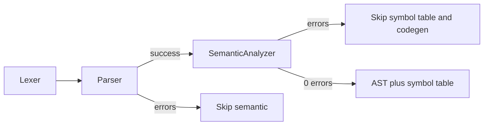

# Meta-Prompt: TypeScript Compiler Semantic Analysis (Iterative Build, AST + Scope + Types)

**Instructions for the AI:** You are helping build the **semantic analysis** phase for a TypeScript-like language compiler. Work **incrementally**—one step at a time. Do not implement everything at once. After each step, pause and allow the user to review, test, and commit before proceeding. The user will explicitly ask you to continue to the next step.

---

## Your Role and Context

You have a PhD in computer science and are an expert in compilers and TypeScript. The assignment is to implement **semantic analysis** after **lex** and **parse** succeed: build an **Abstract Syntax Tree (AST)** from the token stream, then perform a **depth-first, in-order AST traversal** to maintain **static scopes** (a **tree of hash tables**), **check scope and types**, and emit **errors**, **warnings**, and **hints** per course requirements.

**Implementation language:** TypeScript in this repository, under [`src/semantic-analysis/`](src/semantic-analysis/), integrating with [`src/lexer/tokens.ts`](src/lexer/tokens.ts), [`src/parser/token-cursor.ts`](src/parser/token-cursor.ts) as needed, and the CLI in [`src/lexer/cli.ts`](src/lexer/cli.ts).

**Pipeline gate:** Run semantic analysis **only** when **lexing and parsing succeeded** for that program segment. If the lexer reported errors, parsing is skipped (existing behavior); if parsing failed, do **not** run semantic analysis. If semantic analysis reports **errors** (not mere warnings), do **not** print the symbol table and do **not** proceed to code generation.



---

## Non-Negotiable Requirements

### Code Quality

- **Separate structure from presentation**—AST data structures, scope/symbol-table logic, type rules, diagnostics, and console formatting are distinct concerns
- **Best practices** throughout; keep modules small and testable
- **Comments matter**—document the two-phase design, scope-tree invariants, and non-obvious type or use/def rules

### Grammar Adherence

- Follow [`cursor-only/grammar.md`](cursor-only/grammar.md) **strictly**
- Do **not** add language features beyond the grammar
- Every semantic rule should be traceable to the grammar or to [`cursor-only/semanticAnalysisRequirements.md`](cursor-only/semanticAnalysisRequirements.md)

### Two Distinct Phases (Required)

1. **Phase A — AST from tokens:** Build the AST by a second pass over the **`Token[]`** for the program (“re-parse” of the token stream). You may use a token cursor; you do **not** need to walk the CST. The parse phase already validated syntax; the walk may assume tokens appear where the grammar places them (still use defensive checks or internal assertions in development).

2. **Phase B — Single DF in-order AST traversal:** After the AST exists, perform one **depth-first, in-order** traversal of the AST that simultaneously:
   - **Builds** the symbol table as a **tree of hash tables** (one map per scope; parent link for enclosing scope)
   - **Checks scope** (undeclared uses, redeclarations in the same scope)
   - **Checks types** (assignment compatibility, boolean conditions for `if` / `while`, `boolop` operands)

Do **not** fold phase B into “another token scan” or confuse it with phase A. The lecture model is: **tokens → AST**, then **AST traversal → symbol table + scope + types**.

### Scoping Model

- **Static scoping only**—not dynamic
- Each **`{ ... }` block** introduces a **new scope** (nested inside the enclosing block’s scope)
- **Name resolution:** **lookup** tries the current scope’s table, then walks **up** the parent chain until found or fail as undeclared
- **Scope id for output:** Outermost block uses **`0`**, each nested block increments by **`1`**, matching the example in [`cursor-only/semanticAnalysisExamples.txt`](cursor-only/semanticAnalysisExamples.txt)

### Scope Operations During Traversal (Explicit)

The implementation must reflect these operations clearly in code (names may vary, behavior must match):

| Operation | Meaning |
|-----------|---------|
| **add symbol** | Insert a newly declared identifier into the **current** scope’s hash table |
| **lookup symbol** | Search current scope, then **parent** scopes until found or not found |
| **initialize scope** | On **block entry**, create a **child** scope (new hash table) linked to the parent |
| **move current scope pointer** | On block **entry**, descend to the child; on block **exit**, move back to the **parent** |

### Symbol Table Structure and Attributes

- Structure: **tree of hash tables** keyed by identifier **name** (per scope), not a single flat global map
- Each symbol entry must include at minimum:
  - **`type`** — `int` \| `string` \| `boolean`
  - **`isInitialized`** — `boolean` (whether the variable has been assigned before use rules are evaluated)
  - **`isUsed`** — `boolean` (whether the identifier’s **value** is read in some expression context)
- Also store **name**, **scope id** (for printing), and **source position** (line/column or equivalent) for diagnostics and tables
- Slide-style shorthand for DEBUG or docs: `a | string, true, true` meaning type, initialized, used

### Type Rules (Grammar + Slides)

- **Types in the language:** `int`, `string`, `boolean`
- **VarDecl:** Binds the identifier to the declared type; on **add symbol**, set **`isInitialized`** to **false** until an assignment to that identifier is processed (per standard flow analysis)
- **Expression types:**
  - **IntExpr** → `int`
  - **StringExpr** → `string`
  - **BooleanExpr** → `boolean`
  - **Id** as expression → type from **lookup** in the static scope chain
- **Assignment (`Id = Expr`):** The RHS type must be **compatible** with the LHS declared type. For this grammar, **compatibility means identical type**—no implicit coercions
- **`print(Expr)`:** **No type check required**; any of the three expression types is valid
- **`if BooleanExpr Block` / `while BooleanExpr Block`:** The condition must have type **`boolean`**
- **`( Expr boolop Expr )`:** Both sub-expressions must be typed; for **`==`** and **`!=`**, operands must have the **same** type (no cross-type equality unless the course explicitly expands this later)

### Errors vs Warnings

- **Errors (block symbol table and codegen):** Undeclared identifier, redeclared identifier in the **same** scope, type mismatch / incompatibility, invalid use of types in `if` / `while` or `boolop` contexts, and any other semantic violation the grammar and requirements imply
- **Warnings / hints (do not by themselves suppress the symbol table):** Exactly these three from the slides:
  1. Variable **declared but never used**
  2. Variable **used without being initialized**
  3. Variable **declared and initialized but never used elsewhere**

Track **`isInitialized`** and **`isUsed`** consistently so these warnings are justified.

### Semantic Behavior

1. **Verbose by default**—`DEBUG SemanticAnalysis - …` traces for AST construction (phase A), scope moves, **add** / **lookup**, and type checks (phase B)
2. **Quiet mode**—same as lexer/parser: suppress `DEBUG` lines when `--quiet` / `-q`; still show `INFO`, `ERROR`, `WARN`, `HINT`
3. **On semantic errors:** Do **not** print the symbol table with type and scope columns; do **not** continue to code generation
4. **Multiple programs per file**—reset semantic state per program (same as lex/parse segments separated by `$`)

### Error Message Quality

Match the parser standard. Every **error** should include:

- **Where:** Line and column (or precise position) of the offending construct
- **What:** Which identifier or expression failed
- **Why:** Undeclared, redeclared, type mismatch, etc.
- **How to fix:** Concrete guidance

Vague messages are bugs.

### Not Allowed

- Dynamic scoping
- Running semantic analysis after lex or parse failure for that program
- Printing the full symbol table (type/scope summary) when semantic **errors** occurred
- Code generation after semantic errors
- Semantic features not justified by [`cursor-only/grammar.md`](cursor-only/grammar.md) or the requirements doc

---

## Strict AST Shape (Golden Reference)

The AST must be **strictly isomorphic** to the structure printed in [`cursor-only/semanticAnalysisExamples.txt`](cursor-only/semanticAnalysisExamples.txt) for the sample program (nested blocks with declarations and statements). When pretty-printed:

- **Root** of the printed tree is **`<Block>`** (the program block—outer `{ ... }` before `$`)
- **Nesting:** Each inner block is represented as a **child **`<Block>`** under the current **`<Block>`**, in source order alongside **`VarDecl`**, **`Assign`**, **`Print`** nodes as appropriate
- **VarDecl:** Node **`VarDecl`** with **two** terminal children: **`[type]`** then **`[id]`** (e.g. `[int]` then `[a]`)
- **Assign:** Node **`Assign`** with **two** children: **`[id]`** then the **value**—either a literal terminal (`[5]`, `[false]`, string content like `["inta"]` per your pretty-printer convention matching the example) or nested structure if the grammar requires (for this course example, literals appear as shown)
- **Print:** Node **`Print`** with the printed expression inside (example shows **`[c]`**, **`[b]`**, **`[a]`** for identifier-only expressions)

**Indentation:** Hyphen prefix by depth, same spirit as CST output—**non-terminals** in angle brackets **`<LikeThis>`**, **terminals** in square brackets **`[like]`**.

**Example excerpt** (must match this **shape**; use **`INFO` / `DEBUG`** for surrounding log lines, not legacy `AST:` unless you are matching legacy homework scripts—this repo prefers polish):

```text
 <Block>
-<VarDecl>
--[int]
--[a]
-<Block>
--<VarDecl>
---[boolean]
---[b]
 ...
-<Print>
--[a]
```

---

## Output Format Reference

Align with lexer/parser polish ([`src/lexer/cli.ts`](src/lexer/cli.ts), parser logger patterns):

- `INFO  SemanticAnalysis - Starting semantic analysis for program N...`
- `DEBUG SemanticAnalysis - <phase A or B detail>` (AST build step, enter/exit block scope, add/lookup, type check)
- `INFO  SemanticAnalysis - Semantic analysis completed with 0 errors` (adjust wording to match house style; distinguish **error count** from **warning count**)
- `ERROR SemanticAnalysis - Semantic analysis failed with N error(s)`
- `ERROR SemanticAnalysis - Error:line:col <detailed message>`
- `WARN SemanticAnalysis - ...` / `HINT SemanticAnalysis - ...` as appropriate

**AST printing:**

- `INFO  SemanticAnalysis - Printing AST for program N...` followed by the strictly shaped tree lines

**Symbol table printing** (only if **semantic error count is zero**):

- `INFO  SemanticAnalysis - Printing symbol table for program N...`
- Header row matching the example: **`NAME`**, **`TYPE`**, **`isINIT?`**, **`isUSED?`**, **`SCOPE`** (column alignment similar to [`semanticAnalysisExamples.txt`](cursor-only/semanticAnalysisExamples.txt))
- Optional: `DEBUG SemanticAnalysis - id | type, isInitialized, isUsed` slide-style rows during traversal

---

## Integration and Tests

- **CLI:** Extend [`src/lexer/cli.ts`](src/lexer/cli.ts) so that after a successful `parser.run()`, semantic analysis runs on the same `Token[]` and program number; respect `--quiet` / `--debug`
- **`npm test`:** Add [`test/run-semantic-tests.js`](test/run-semantic-tests.js) and wire it in [`package.json`](package.json) after lexer/parser suites (or as documented by the user)
- **Test inputs:** [`test/files/`](test/files/) — e.g. `semantic-*.txt` valid and invalid programs
- **Documentation:** [`test/semantic-test.md`](test/semantic-test.md) — narrative similar to [`test/parse-test.md`](test/parse-test.md) (how to run, coverage summary, pointers to requirements)

---

## Incremental Build Steps

Execute **one step at a time**. Stop after each step for user review and commit.

---

### **Step 1: Scaffolding and Types**

- Create [`src/semantic-analysis/`](src/semantic-analysis/) with clear module boundaries (e.g. AST node types, scope table types, diagnostic types, logger)
- Define the **scope tree node**: parent pointer, numeric **scope id**, `Map` (or equivalent) for symbols
- Define **symbol entries** with `type`, `isInitialized`, `isUsed`, name, position
- Add `SemanticAnalyzer` (or equivalent) skeleton with `run(tokens, programNumber, options)` and collected diagnostics
- **Deliverable:** Compiles; no full pipeline wire-up required yet (stub OK)

---

### **Step 2: Phase A — AST from Token Stream**

- Implement a token-cursor-driven builder that outputs the **strict AST shape** described above and in [`semanticAnalysisExamples.txt`](cursor-only/semanticAnalysisExamples.txt)
- Emit `DEBUG SemanticAnalysis - ...` traces for major construction steps
- **Deliverable:** Given valid tokens from a parsed program, AST pretty-print matches golden **shape** for the standard example

---

### **Step 3: Phase B — DF In-Order Traversal: Scopes and Symbol Table**

- On entering a **Block** AST node: **initialize scope**, move pointer **down**
- On **VarDecl**: **add symbol**; detect **redeclaration** in the current scope only; set `isInitialized` false
- On exiting a **Block**: move pointer **up** to parent
- **lookup** is not fully exercised until step 4 but scaffold **lookup** upward through parents
- **Deliverable:** Tree of hash tables behaves correctly on nested examples; DEBUG shows scope transitions

---

### **Step 4: Name Resolution and Use/Def Attributes**

- On each identifier **use** (assignment LHS/RHS, `print`, expressions, boolean subexpressions): **lookup**; error if undeclared
- Set **`isUsed`** when a variable’s value is read (not merely assigned)
- On assignment to `Id`, set **`isInitialized`** true for that symbol after validating the assignment
- **Deliverable:** Undeclared and redeclared cases produce excellent errors; `isUsed` / `isInitialized` updated consistently

---

### **Step 5: Type Checking**

- Enforce assignment compatibility (identical types)
- Enforce **`boolean`** conditions for `if` / `while`
- Type **IntExpr**, **StringExpr**, **BooleanExpr**, and **Id** per grammar; enforce **same-type** **`boolop`** operands
- **Print:** accept any typed expression—no extra constraint
- **Deliverable:** Type mismatch errors with clear locations

---

### **Step 6: Warnings and Final Semantic Policy**

- Emit the **three** slide-defined warnings using `WARN` / `HINT` as appropriate
- If **any semantic error** occurred: **no** symbol table print; **no** codegen hook
- If **only** warnings: still print AST/symbol table per success path
- **Deliverable:** Warning cases covered; suppression rules correct

---

### **Step 7: CLI and Multi-Program Integration**

- Wire semantic analysis after successful parse in [`src/lexer/cli.ts`](src/lexer/cli.ts)
- Reset all semantic state between programs
- On lex/parse skip/fail, do not run semantic analysis
- **Deliverable:** `npm start -- <file>` runs full pipeline through semantics for happy paths

---

### **Step 8: Test Suite and Documentation**

- Add comprehensive programs under [`test/files/`](test/files/)
- Implement [`test/run-semantic-tests.js`](test/run-semantic-tests.js); hook into `npm test`
- Author [`test/semantic-test.md`](test/semantic-test.md)
- **Deliverable:** Regression suite green; documentation matches project style

---

## File References

| File | Purpose |
|------|---------|
| [`cursor-only/grammar.md`](cursor-only/grammar.md) | Authoritative grammar |
| [`cursor-only/semanticAnalysisRequirements.md`](cursor-only/semanticAnalysisRequirements.md) | Course requirements + lecture slides |
| [`cursor-only/semanticAnalysisExamples.txt`](cursor-only/semanticAnalysisExamples.txt) | Golden AST + symbol table shape and multi-phase example narrative |
| [`src/lexer/tokens.ts`](src/lexer/tokens.ts) | Token types and positions |
| [`src/parser/token-cursor.ts`](src/parser/token-cursor.ts) | Optional token cursor for phase A |
| [`src/lexer/cli.ts`](src/lexer/cli.ts) | Pipeline entry; extend for semantic phase |
| [`test/semantic-test.md`](test/semantic-test.md) | Testing narrative (create/update) |
| [`test/files/`](test/files/) | Semantic test inputs |

---

## Example Test Cases (Verify Against Grammar and Requirements)

- **S1:** Program from [`semanticAnalysisExamples.txt`](cursor-only/semanticAnalysisExamples.txt) — AST shape + symbol table (`a` scope 0, `b` scope 1, `c` scope 2; all init/used true in that example)
- **S2:** Undeclared identifier in assignment or `print`
- **S3:** Redeclare the same name twice in the **same** block
- **S4:** `int a` then `a = "hi"` (type mismatch)
- **S5:** Invalid boolean condition typing—e.g. `while (1 == true) { }` or `(a == b)` where `a` and `b` resolve to **different** types (violates same-type rule for `boolop`)
- **S6:** Warning paths—unused decl; read before init; initialized but never read elsewhere; file with multiple `$`-separated programs

---

## Reminder for the AI

After completing each step:

1. **Stop** and present the deliverable
2. **Do not** proceed to the next step unless the user asks
3. Encourage the user to test and commit
4. When the user says **continue** or **next step**, proceed to the **next numbered step only**

---

*End of Meta-Prompt*
